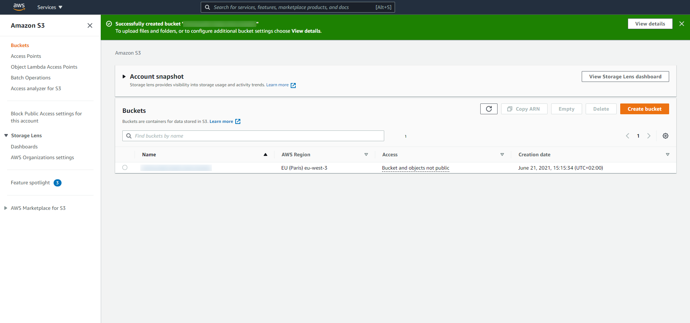
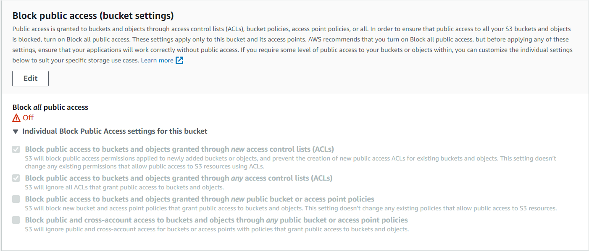

# 02 S3 Portal

En este ejemplo vamos a aprender a trabajar con almacenamiento de ficheros en S3.

Tomamos como punto de partida `01-local-files`.

# Steps to build it

Si no lo tienes ya hecho acuérdate de hacer install en back y front y arrancar ambos proyectos.

Abrimos un terminal y lo dejamos corriendo:

```bash
cd front
npm install

```

Abrimos un segundo terminal y hacemos lo mismo, esta vez con el back:

```bash
cd back
npm install

```

Esta vez vamos a subir las imágenes a un [Amazon S3 service](https://aws.amazon.com/es/s3/), empezaremos por crear el bucket y subirlas de forma manual (usando el UI de AWS):

Buscamos el servicio S3 y vamos a esta pantalla:


Vmaos a crear un nuevo bucket, le damos un nombre y dejamos los valores por defecto:


> Ojo este bucket debe tener un nombre único para TODAS las cuentas de amazon s3 (no solo la nuestra) y debe seguir unas reglas (pon el tuyo propio en este ejemplo).
>
> [Bucket name rules](https://docs.aws.amazon.com/AmazonS3/latest/userguide/bucketnamingrules.html)
>
> La región donde lo creemos también es muy importante (cuanto más cerca este de tu back y front mejor).



Vamos a subir un fichero de forma manual (en este caso el avatar del admin), para ello pinchamos el en el botón de upload:


Subimos `admin-avatar-in-s3.png` desde la carpeta `99-resources`:


Si intentamos acceder a la url del objeto (`Object URL`), Amazon nos devolverá un XML como este:

```xml
<Error>
  <Code>AccessDenied</Code>
  <Message>Access Denied</Message>
  <RequestId>some-request-id</RequestId>
  <HostId>some-host-id</HostId>
</Error>
```

Por defecto el bucket y los objetos no tienen acceso público, pero tenemos varias formas de dar acceso:

- Hacer el bucket y el objeto públicos: tendremos que añadir algunos permisos, por ejemplo, podemos por ejemplo permitir solo acceso de lectura, esto puede estar bien en alguno casos, pero si por ejemplo tenemos información privada de un cliente no es buena idea (fotocopia de su DNI... :)).

- Crear un usuario con [IAM service](https://aws.amazon.com/iam/) con credenciales. Esto es válido para aplicaciones backend donde podemos proporcionar las credenciales de forma segura.

- Junto con el enfoque anterior, podemos crear urls firmadas con tiempo de expiración y enviarlas a los `web-clients`, así, un usuario la puede tener disponible por X minutos, y no tiene que pasar por nuestro servidor.

Arrancamos por la más sencilla, hacer el bucket y el objeto públicos, para ello vamos a dar permisos de lectura:


**Block public access (bucket settings)**

Lo primero, desmarcamos `Block all public access`:



**Bucket policy**

Aquí nos saldrá un mensaje del tipo ¿Estás seguro? Y nos hará meter un texto de confirmación.

Y en el _bucket-policy_ (política del bucket) le damos permisos de sólo lectura:

** OJO PON AQUI EL NOMBRE DE TU BUCKET, cambia `NOMBRE-DEL-BUCKET` por el tuyo**

```json
{
  "Version": "2012-10-17",
  "Statement": [
    {
      "Sid": "PublicRead",
      "Effect": "Allow",
      "Principal": "*",
      "Action": ["s3:GetObject", "s3:GetObjectVersion"],
      "Resource": ["arn:aws:s3:::NOMBRE-DEL-BUCKET/*"]
    }
  ]
}
```

> [Granting read-only S3 permission](https://docs.aws.amazon.com/AmazonS3/latest/userguide/example-bucket-policies.html#example-bucket-policies-use-case-2)

Ahora si la url del objeto está disponible, incluso la podemos pasar desde el back para consumirla en la aplicación Front (`client-side`):

OJO CAMBIA LOS DATOS DEL LA URL por tu bucket name, y region en el nombre del fichero (copia la url que habías pegado antes en el navegador):

_./back/src/dals/mock-data.ts_

```diff
...
    {
      _id: new ObjectId(),
      email: 'admin@email.com',
      password: 'test',
      salt: '',
      role: 'admin',
-     avatar: '/admin-avatar.png',
+     avatar: 'https://<bucket-name>.s3.<region>.amazonaws.com/admin-avatar-in-s3.png',
    },
...
```

Vamos a ejecutar `front` y `back` para comprobar que funciona:

_front terminal_

```bash
npm start

```

_back terminal_

```bash
npm start
```

> Acuérdate que para entrar en el login la combinación es _email: 'admin@email.com'_ y _password: 'test'_.

Abrimos el navegador `http://localhost:8080` y... Taaachaaan :)

# ¿Con ganas de aprender Backend?

En Lemoncode impartimos un Bootcamp Backend Online, centrado en stack node y stack .net, en él encontrarás todos los recursos necesarios: clases de los mejores profesionales del sector, tutorías en cuanto las necesites y ejercicios para desarrollar lo aprendido en los distintos módulos. Si quieres saber más puedes pinchar [aquí para más información sobre este Bootcamp Backend](https://lemoncode.net/bootcamp-backend#bootcamp-backend/banner).
