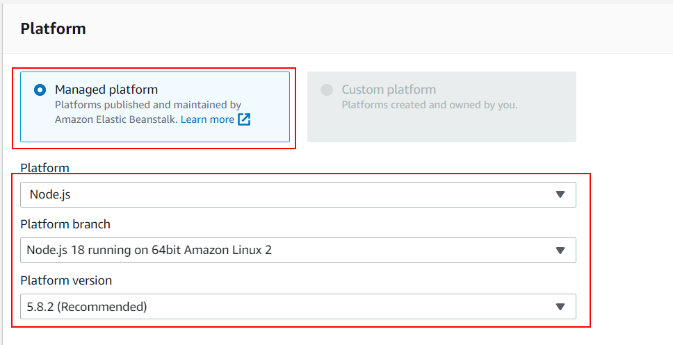

# 04 Manual AWS deploy

In this example we are going to learn how to manual deploy in AWS.

We will start from `03-mongo-deploy`.

# Steps to build it

`npm install` to install previous sample packages:

```bash
cd front
npm install

```

In a second terminal:

```bash
cd back
npm install

```

This time, we will deploy our web app in AWS using the [Beanstalk Service](https://aws.amazon.com/elasticbeanstalk/).

Let's create a beanstalk app:


Give a name:


Choose NodeJS platform:



Before upload the code, we will create a `zip` file with same files that we deploy on Heroku example. Let's copy all necessary files:

- `dist` folder content.
- `public` folder.

Create `package.json`:

_./package.json_

```json
{
  "name": "01-config",
  "version": "1.0.0",
  "description": "",
  "main": "index.js",
  "scripts": {
    "start": "node index"
  },
  "keywords": [],
  "author": "",
  "license": "ISC",
  "dependencies": {
    "@aws-sdk/client-s3": "^3.18.0",
    "@aws-sdk/s3-request-presigner": "^3.18.0",
    "cookie-parser": "^1.4.5",
    "cors": "^2.8.5",
    "dotenv": "^10.0.0",
    "express": "^4.17.1",
    "jsonwebtoken": "^8.5.1",
    "mongodb": "^3.6.9",
    "mongoose": "^5.12.12"
  }
}

```

Result:

```
|- common/
|- common-app/
|- core/
|- dals/
|- pods/
|- public/
|- .gitignore
|- app.js
|- index.js
|- package.json

```

Create `zip` file:


Update code:


Let's add `env variables`:


> NOTE: Since aws security group was configured only with HTTP inbound rule, we have to set `NODE_ENV` equals `development` to avoid create Cookie with secure flag.

Create app:


# ¿Con ganas de aprender Backend?

En Lemoncode impartimos un Bootcamp Backend Online, centrado en stack node y stack .net, en él encontrarás todos los recursos necesarios: clases de los mejores profesionales del sector, tutorías en cuanto las necesites y ejercicios para desarrollar lo aprendido en los distintos módulos. Si quieres saber más puedes pinchar [aquí para más información sobre este Bootcamp Backend](https://lemoncode.net/bootcamp-backend#bootcamp-backend/banner).
