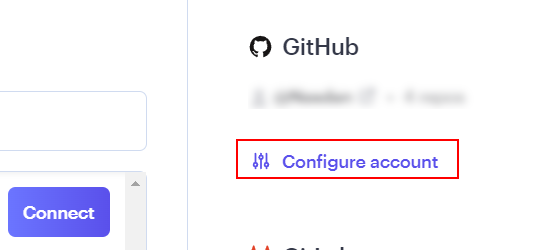
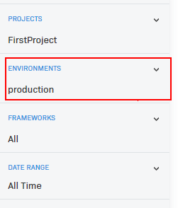
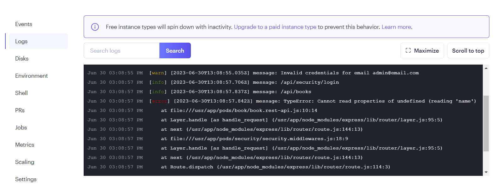

# 03 Deploy Render

En este ejemplo vamos a desplegar la aplicación en `Render`.

Tomamos como punto de partida el ejemplo `02-custom-transport`.

# Steps to build it

Si no lo hemos hecho antes, instalamos las dependencias de back y front.

En un terminal:

```bash
cd front
npm install

```

Abrimos un segundo terminal:

```bash
cd back
npm install

```

Esto de `Rollbar` esta muy bien, pero para que nos envíe y almacen logs de producción o de entornos pre, pero en nuestro local es un poco rollo ir metiendo trallazos desde localhost, así que vamos a configurarlo de forma que solo se envíen los logs a `Rollbar` cuando estemos en producción.

_./back/src/core/logger/logger.ts_

```diff
import { createLogger } from 'winston';
+ import Transport from 'winston-transport';
+ import { envConstants } from '#core/constants/index.js';
import { console, file, rollbar } from './transports/index.js';

+ let transports: Transport[] = [console, file];
+ if (envConstants.isProduction) {
+   transports = [...transports, rollbar];
+ }

export const logger = createLogger({
- transports: [console, file, rollbar],
+ transports,
});

```

Acualizamos el docker file para usar de momento al API_MOCK (más adelante lo actualizarekos, o incluso en el propio `Render`)

_./Dockerfile_

```diff
...

+ ENV NODE_ENV=production
ENV STATIC_FILES_PATH=./public
- ENV API_MOCK=false
+ ENV API_MOCK=true
ENV CORS_ORIGIN=false

...
```

Creamos un nuevo repositorio y subimos los ficheros (aquí podemos hacerlo por comando, o usar el método sucio y rápido que vimos antes :)):


```bash
git init
git remote add origin git@github.com...
git add .
git commit -m "initial commit"
git push -u origin main

```

Creamos una nueva app en `Render`:


Configuramos la cuenta para tener acceso al nuevo repositorio:



Configuramos el web service:


Añadimos la variables de entorno (Advanced settings):


Actualizamos los docker settings:


Clicamos en el botón `Create Web Service`:

Abrimos el navegador en la url: `https://<app-name>.onrender.com` y le damos caña para que genera eventos de `info`, `warn` y `error` logs.

Vamos a ver si han llegado los logs a `Rollbar`, IMPORTANTE acuérdate de filtrar por entorno (seguramente no esté `producción` seleccionado y te salga en blanco)



Vamos a ver los logs en `Render`:



# ¿Con ganas de aprender Backend?

En Lemoncode impartimos un Bootcamp Backend Online, centrado en stack node y stack .net, en él encontrarás todos los recursos necesarios: clases de los mejores profesionales del sector, tutorías en cuanto las necesites y ejercicios para desarrollar lo aprendido en los distintos módulos. Si quieres saber más puedes pinchar [aquí para más información sobre este Bootcamp Backend](https://lemoncode.net/bootcamp-backend#bootcamp-backend/banner).
