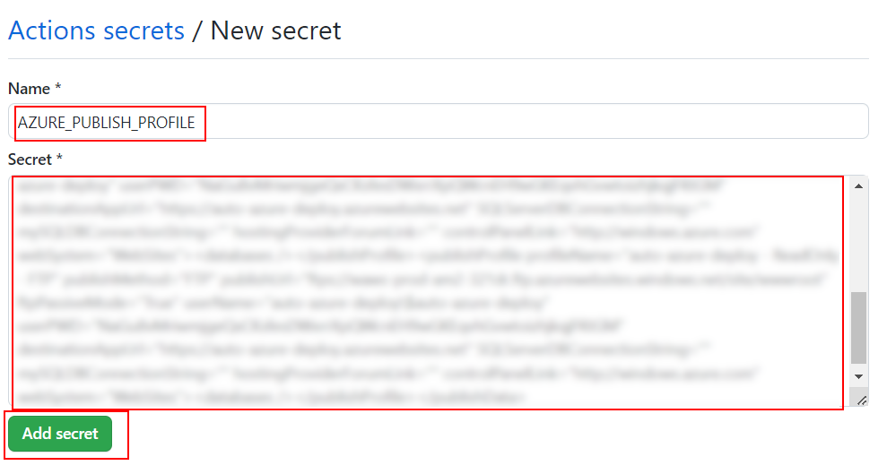

# 08 Automatic Azure deploy

In this example we are going to deploy app to Azure using Docker

We will start from `08-auto-render-deploy`.

# Steps to build it

`npm install` to install previous sample packages:

```bash
cd front
npm install

```

In a second terminal:

```bash
cd back
npm install

```

Create new repository and upload files:


```bash
git init
git remote add origin git@github.com...
git add .
git commit -m "initial commit"
git push -u origin main

```

Create a new Azure app:


Configure the new app instance details:


Configure pricing plans:


As we can see, this app will deploy an example of Microsoft Docker Image. We can provide our custom Docker image in the configuration section using environment variables:


> [Offical Docs deploy to azure app](https://docs.github.com/en/actions/deployment/deploying-to-your-cloud-provider/deploying-to-azure/deploying-docker-to-azure-app-service)

If we want a public image we can use the previous uploaded image that we push to Docker Hub in the previous example or we can upload a private one using [Github Packages](https://github.com/features/packages).

> [Official Github Container Registry Docs](https://docs.github.com/en/packages/working-with-a-github-packages-registry/working-with-the-container-registry)

Create a new Github Personal Access Token:


Clicks on _Generate token_ button and update values in Azure configuration section:


> NOTE: use your Github username or organization name instead of `lemoncode` for `DOCKER_REGISTRY_SERVER_USERNAME`.

Add environment variables to our app:


Now we can create a Github Action workflow to deploy our app to Azure:

_./.github/workflows/cd.yml_

```yml
name: CD Workflow

on:
  push:
    branches:
      - main

env:
  IMAGE_NAME: ghcr.io/${{github.repository}}:${{github.run_number}}-${{github.run_attempt}}

permissions:
  contents: "read"
  packages: "write"
```

> `github.repository`: The repository name with the owner. For example, `octocat/hello-world`. You only can use this variable if it's lower case due to a Docker tag restriction: `--tag" flag: invalid reference format: repository name must be lowercase`
> 
> For example, you can use `github.run_number` and `github.run_attempt` to create a unique image tag. But you can use any other tag.
>
> [Github context API](https://docs.github.com/en/actions/learn-github-actions/contexts#github-context)

Define job to build and push image to Github Container Registry:

_./.github/workflows/cd.yml_

```diff
...
permissions:
  contents: 'read'
  packages: 'write'

+ jobs:
+   cd:
+     runs-on: ubuntu-latest
+     steps:
+       - name: Checkout repository
+         uses: actions/checkout@v3

+       - name: Log in to GitHub container registry
+         uses: docker/login-action@v2
+         with:
+           registry: ghcr.io
+           username: ${{ github.actor }}
+           password: ${{ secrets.GITHUB_TOKEN }}

+       - name: Build and push docker image
+         run: |
+           docker build -t ${{env.IMAGE_NAME}} .
+           docker push ${{env.IMAGE_NAME}}

+       - name: Deploy to Azure
+         uses: azure/webapps-deploy@v2
+         with:
+           app-name: ${{ secrets.AZURE_APP_NAME }}
+           publish-profile: ${{ secrets.AZURE_PUBLISH_PROFILE }}
+           images: ${{env.IMAGE_NAME}}

```

> [GITHUB_TOKEN automatic token authentication](https://docs.github.com/en/actions/security-guides/automatic-token-authentication)

Create `secrets` in Github repository:


- `AZURE_APP_NAME` (same value as you name your app in Azure):


- `AZURE_PUBLISH_PROFILE` (you can download it from Azure portal and paste the value in the secret):




Upload changes:

```bash
git add .
git commit -m "create github workflow"
git push

```

The deploy is failing with this error `Container ID <some-id> cannot be mapped to a host IDErr: 0, Message: failed to register layer: Error processing tar file(exit status 1): Container ID <some-id> cannot be mapped to a host ID`.

The issue is related with file permissions, we need to update our Dockerfile to use a specific version of npm. [This issue is fixed in npm 9.6.0](https://github.com/npm/pacote/pull/261), so let's update to the latest npm version:

_./Dockerfile_

```diff
...
COPY ./back/package-lock.json ./
RUN sed -i 's/.\/dist/./' package.json
+ RUN npm install -g npm@latest
RUN npm ci --only=production

ENV STATIC_FILES_PATH=./public
ENV API_MOCK=false
ENV CORS_ORIGIN=false

CMD node index
```

> References:
>
> [Azure issue](https://github.com/projectkudu/kudu/issues/2512)
>
> [NPM fix on 9.6.0](https://github.com/npm/pacote/pull/261)
>
> [Stackoverflow](https://stackoverflow.com/questions/62569958/deploying-docker-image-from-azure-container-registry-to-web-app-container-faile)

After the successful deploy, open `https://<app-name>.azurewebsites.net`.

# ¿Con ganas de aprender Backend?

En Lemoncode impartimos un Bootcamp Backend Online, centrado en stack node y stack .net, en él encontrarás todos los recursos necesarios: clases de los mejores profesionales del sector, tutorías en cuanto las necesites y ejercicios para desarrollar lo aprendido en los distintos módulos. Si quieres saber más puedes pinchar [aquí para más información sobre este Bootcamp Backend](https://lemoncode.net/bootcamp-backend#bootcamp-backend/banner).
