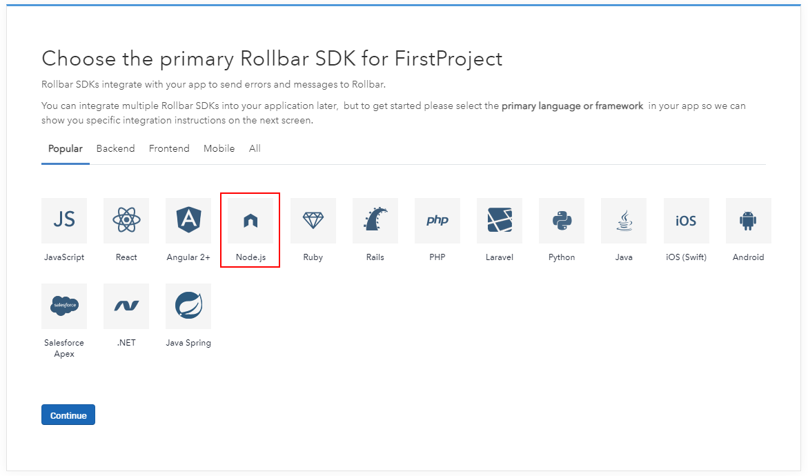
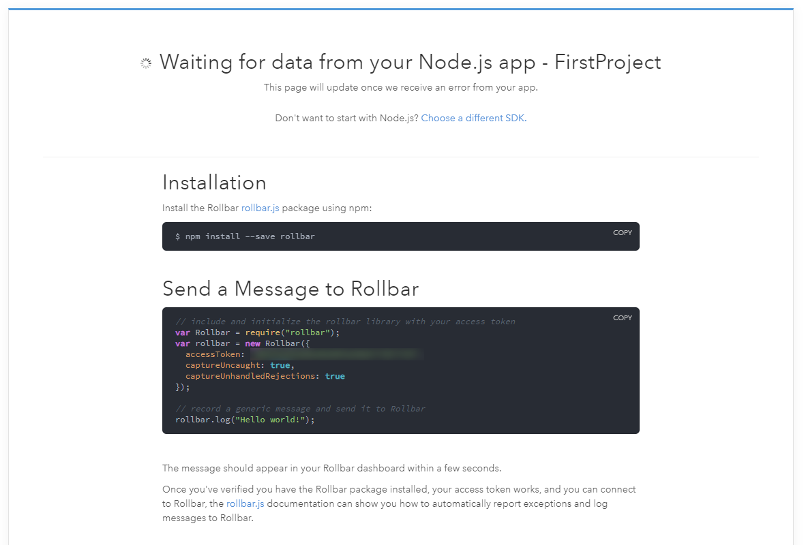
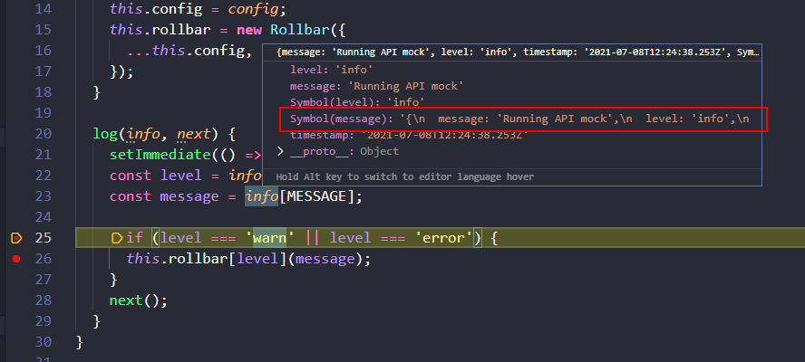

# 02 Custom transport

In this example we are going to create a custom logger transport.

We will start from `01-logging`.

# Steps to build it

`npm install` to install previous sample packages:

```bash
cd front
npm install

```

In a second terminal:

```bash
cd back
npm install

```

In this example, we will create a custom logger transport, in this case, we will send the logs to [rollbar](https://rollbar.com/).

First, let's create a new account and select the SDK language:



Now, rollbar is waiting for data from our app:



Let's install rollbar:

```bash
npm install rollbar --save

```

Since there isn't any official winston rollbar transport, we will create a custom transport. We will explicitly install `winston`'s internal dependencies to create new transport:

```bash
npm install winston-transport triple-beam --save

```

> [Adding custom transports](https://github.com/winstonjs/winston#adding-custom-transports)

Add rollbar transport:

_./back/src/common/logger-transports/rollbar.transport.ts_

```javascript
import Transport from 'winston-transport';
import Rollbar, { Configuration } from 'rollbar';
import { MESSAGE } from 'triple-beam';

type Config = Transport.TransportStreamOptions & Configuration;

export class RollbarTransport extends Transport {
  private config: Config;
  private rollbar: Rollbar;

  constructor(config: Config = {}) {
    super(config);

    this.config = config;
    this.rollbar = new Rollbar({
      ...this.config,
    });
  }

  log(info, next) {
    setImmediate(() => this.emit('logged', info));
    const level = info.level;
    const message = info[MESSAGE];
    this.rollbar[level](message);
    next();
  }
}

```

> In future, we could create a custom library for it.

We need to access `info[MESSAGE]` if we want to log the formatted message instead the raw one:



Add barrel file

_./back/src/common/logger-transports/index.ts_

```javascript
export * from './rollbar.transport';

```

Add rollbar transport instance (NOTE: Pending to add constants):

_./back/src/core/logger/transports/rollbar.transport.ts_

```javascript
import { format } from 'winston';
import { RollbarTransport } from 'common/logger-transports';
import { envConstants } from 'core/constants';

const { combine, timestamp, prettyPrint } = format;

export const rollbar = new RollbarTransport({
  accessToken: envConstants.ROLLBAR_ACCESS_TOKEN,
  environment: envConstants.ROLLBAR_ENV,
  captureUncaught: envConstants.isProduction,
  captureUnhandledRejections: envConstants.isProduction,
  format: combine(timestamp(), prettyPrint()),
  level: 'warn',
});

```

> [Rollbar docs](https://docs.rollbar.com/docs/nodejs)

Update barrel file:

_./back/src/core/logger/transports/index.ts_

```diff
export * from './console.transport';
export * from './file.transport';
+ export * from './rollbar.transport';

```

Add `env variables`:

_./back/.env.example_

```diff
...
+ ROLLBAR_ACCESS_TOKEN=value
+ ROLLBAR_ENV=development

```

_./back/.env_

```diff
+ ROLLBAR_ACCESS_TOKEN=<value-provided-by-rollbar>
+ ROLLBAR_ENV=development

```

_./back/src/core/constants/env.constants.ts_

```diff
export const envConstants = {
  ...
+ ROLLBAR_ACCESS_TOKEN: process.env.ROLLBAR_ACCESS_TOKEN,
+ ROLLBAR_ENV: process.env.ROLLBAR_ENV,
};

```

Use transport:

_./back/src/core/logger/logger.ts_

```diff
import { createLogger } from 'winston';
- import { console, file } from './transports';
+ import { console, file, rollbar } from './transports';

export const logger = createLogger({
- transports: [console, file],
+ transports: [console, file, rollbar],
  exitOnError: false,
});

```

Open browser at `http://localhost:8080/` and run `info`, `warn` and `error` logs. Check results in rollbar.


Another features supported by Rollbar:

- [Deploys and Versions](https://docs.rollbar.com/docs/deploy-tracking): you could correlate deploys and version with customer issues
- [RQL](https://docs.rollbar.com/docs/rql): Rollbar Query Language provides SQL-like interface over Rollbar data.
- [Notifications](https://docs.rollbar.com/docs/notifications): send by email, slack or another app errors occurences.

# ¿Con ganas de aprender Backend?

En Lemoncode impartimos un Bootcamp Backend Online, centrado en stack node y stack .net, en él encontrarás todos los recursos necesarios: clases de los mejores profesionales del sector, tutorías en cuanto las necesites y ejercicios para desarrollar lo aprendido en los distintos módulos. Si quieres saber más puedes pinchar [aquí para más información sobre este Bootcamp Backend](https://lemoncode.net/bootcamp-backend#bootcamp-backend/banner).
