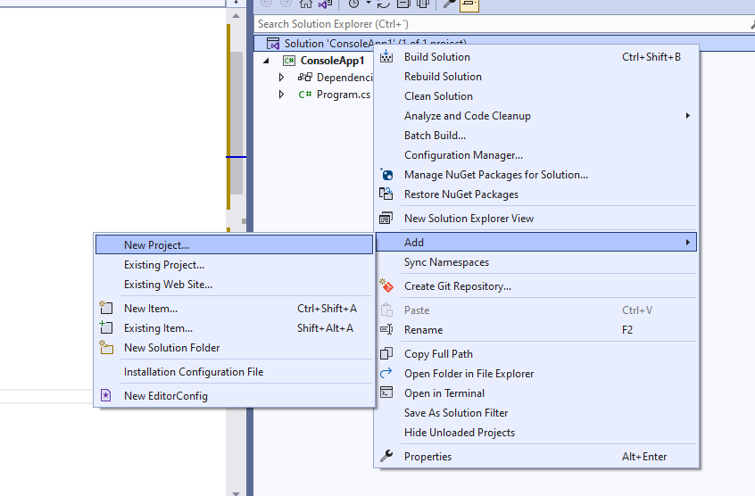
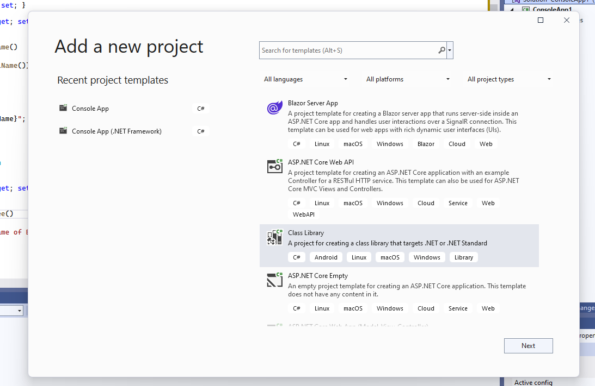
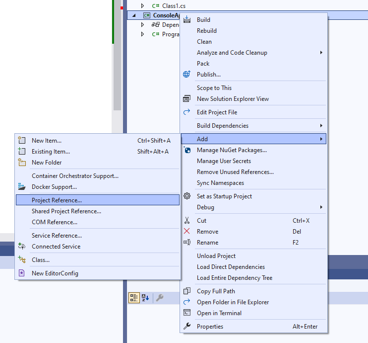
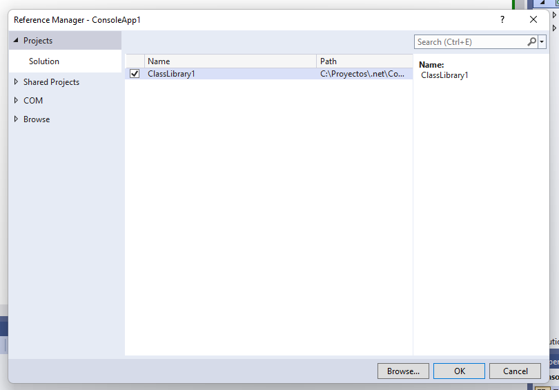
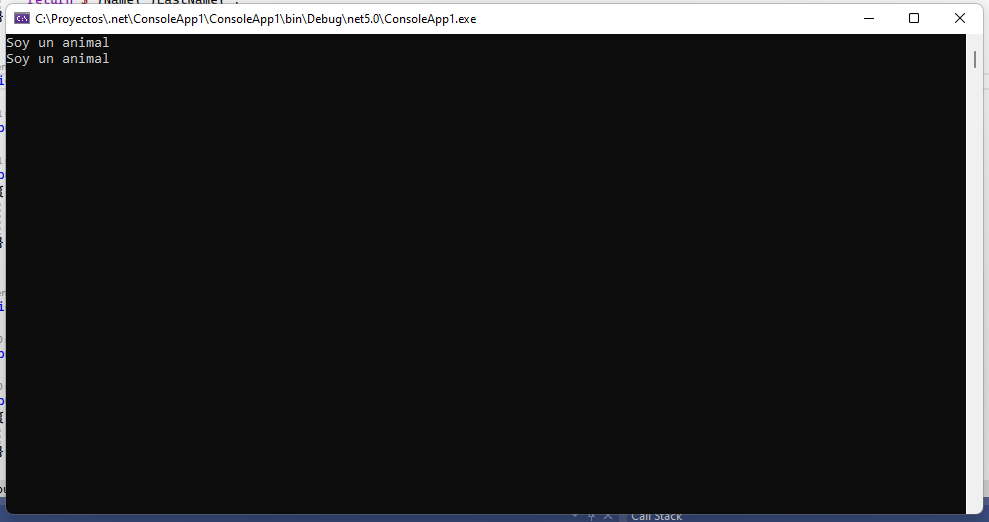

# Programación Orientada a Objetos

Antes de empezar a hablar sobre programación orientada a Objetos, necesitamos introducir el concepto de paradigma.

Un paradigma es una forma de afrontar la construcción de código software. Existen diferentes paradigmas (POO, Estructurado, etc...) y cada uno tienen sus ventajas e inconvenientes, no hay mejores ni peores.

## Clases y Objetos

Una clase es una plantilla que creamos para abstraer un concepto, y a la que podemos definir propiedades, métodos y eventos.

El objeto es la instancia de una clase a la cual podemos asignarles unas propiedades e invocar a sus métodos.

> Ejemplo: una clase podría ser el plano de un motor, y un objeto son los distintos motores que se pueden construir usando dicho plano.

¿Qué nos permite el paradigma de la programación Orientada a Objeto?:

- **Encapsulación**: Agrupa datos y código en una misma clase
- **Herencia**: se crea una nueva clase a partir de otra ya existente, de la cual se heredan todas las propiedades y métodos,  y pueden modificarse agregando o modificando propiedades y métodos heredados. Las clases creadas a partir de otras existentes se llaman **clases derivadas**
- **Polimorfismo**: permite utilizarse diferentes clases de forma intercambiable.

Vamos a analizar la definición de una clase básica

```csharp
public class BankAccount
{
    public string Number { get; }
    public string Owner { get; set; }
    public decimal Balance { get; }

    public void MakeDeposit(decimal amount, DateTime date, string note)
    {
    }

    public void MakeWithdrawal(decimal amount, DateTime date, string note)
    {
    }
}
```

Podemos decir que nuestra clase _BankAccount_ tiene 3 propiedades (_Number_, _Owner_ y _Balance_) y dos métodos (_MakeDeposit_ y _MakeWithdrawal_).

Todas las clases tienen un **método constructor** por defecto, que se define de la siguiente forma:

```diff
public class BankAccount
{
    public string Number { get; }
    public string Owner { get; set; }
    public decimal Balance { get; }

+   public BankAccount()
+   {            
+   }


    public void MakeDeposit(decimal amount, DateTime date, string note)
    {
    }

    public void MakeWithdrawal(decimal amount, DateTime date, string note)
    {
    }
}
```

Este método no es necesario definirlo, ya que todas las clases lo tendrán, pero lo podemos utilizar por ejemplo para darle un valor iniciar a las propiedades. O también podemos crear otros constructores para que el usuario tenga que pasar los valores por defecto de las propiedades a la hora de crear el objeto. 

```diff
public class BankAccount
{
    public string Number { get; }
    public string Owner { get; set; }
    public decimal Balance { get; }

    public BankAccount()
    {           
+       this.Number = " - ";
+       this.Owner = " - ";
+       this.Balance = 0;
    }

+   public BankAccount(string number, string owner, decimal balance)
+   {           
+       this.Number = number;
+       this.Owner = owner;
+       this.Balance = balance;
+   }


    public void MakeDeposit(decimal amount, DateTime date, string note)
    {
    }

    public void MakeWithdrawal(decimal amount, DateTime date, string note)
    {
    }
}
```

Con la palabra reservada _this_ hacemos referencia a las propiedades o métodos definida en la clase. En este caso podemos eliminar la palabra _this_ y no causará ningún error... pero ¿en qué caso no lo podríamos eliminar?

### Modificadores de acceso

En nuestra clase _BankAccount_ podemos ver la palabra reservada _public_ pero ¿qué significa? Pues es lo que conocemos como modificador de acceso, vamos a ver cuáles hay y para qué sirven:

- **public** una clase pública es accesible desde cualquier código en el mismo ensamblado o desde otro ensamblado que haga referencia a éste.
- **private** sólamente el código de la misma clase puede acceder al tipo o miembro.
- **protected** sólamente el código de la misma clase, o de una clase que herede de esa clase puede acceder al tipo o miembro.
- **internal** tiene acceso el código del mismo ensamblado pero no de otro ensamblado distinto.
- **protected internal** cualquier código del mismo ensamblado o desde una clase derivada de otro ensamblado, puede acceder al tipo o miembro.
- **abstract** no permite crear instancias de esta clase, sólo sirve para ser heredada como clase base. Suele tener métodos definidos pero sin ninguna funcionalidad, ya que esos métodos se suelen escribir en las clases derivadas.
- **sealed** cuando una clase es la última de una jerarquía, por lo que no se puede usar como clase base de otra clase.

Vamos a ver esto con unos ejemplos:

Partimos de una aplicación de consola.

```csharp
using System;

namespace ConsoleApp1
{
    internal class Program
    {
        static void Main(string[] args)
        {
        }

    }
}
```

Lo primero que vamos a crear es nuestra clase, y la vamos a incluir en el mismo _namespace_.

```diff
using System;

namespace ConsoleApp1
{
+    public class Person
+    {
+       public string Name { get; set; }
+       public string LastName { get; set; }

+       public string FullName()
+       {
+           return $"{Name} {LastName}";
+       }
+   }

    internal class Program
    {
        static void Main(string[] args)
        {
        }

    }
}
```

Y ahora creamos una instancia de persona desde nuestro método _Main_

```diff
using System;

namespace ConsoleApp1
{
    public class Person
    {
       public string Name { get; set; }
       public string LastName { get; set; }

       public string FullName()
       {
           return $"{Name} {LastName}";
       }
    }

    internal class Program
    {
        static void Main(string[] args)
        {
+            var person = new Person();
+            person.Name = "Pepe";
+            person.LastName = "Garcia";

+            Console.WriteLine(person.FullName());
        }

    }
}
```

Si seleccionamos la línea donde creamos la instancia (_new Person()_) nos aparecerá una bombilla indicando que podemos hacer ese código de forma más "simplificada", si aceptamos su propuesta nos cambiará el código a lo siguiente:

```csharp
using System;

namespace ConsoleApp1
{
        ...
        var person = new Person 
        {
            Name = "Pepe",
            LastName = "Garcia"
        };
        ...        
}
```

Vamos a lo importante, como veis el método _FullName_ es accesible porque está marcado como _public_. Vamos a ver cómo se comporta el modificador _private_.

```diff
using System;

namespace ConsoleApp1
{
    public class Person
    {
       public string Name { get; set; }
       public string LastName { get; set; }

-      public string FullName()
+      private string FullName()
       {
           return $"{Name} {LastName}";
       }
    }

    internal class Program
    {
        static void Main(string[] args)
        {
            var person = new Person 
            {
                Name = "Pepe",
                LastName = "Garcia"
            };

            Console.WriteLine(person.FullName());
        }

    }
}
```

Cuando lo cambiamos como privado, nos marca un error en nuestro método _Main_ porque ya no tiene visibilidad a ese método. Vamos a crear otro método público en _Person_ para ver cómo podríamos hacer esta llamada a _FullName_. A este método lo llamaremos _PrintFullName_.

```diff
using System;

namespace ConsoleApp1
{
    public class Person
    {
       public string Name { get; set; }
       public string LastName { get; set; }
       
+      public void PrintFullName()
+      {
+           Console.WriteLine(FullName());
+      }

       private string FullName()
       {
           return $"{Name} {LastName}";
       }
    }

    internal class Program
    {
        static void Main(string[] args)
        {
            var person = new Person 
            {
                Name = "Pepe",
                LastName = "Garcia"
            };

-            Console.WriteLine(person.FullName());
+            person.PrintFullName();
        }

    }
}
```

Ahora ya no tendríamos el error porque llamamos a método público _PrintFullName_ que internamente llama al método privado _FullName_.

Vamos ahora con ejemplo de _protected_:

```diff
using System;

namespace ConsoleApp1
{
    public class Person
    {
       public string Name { get; set; }
       public string LastName { get; set; }
       
-      public void PrintFullName()
+      protected void PrintFullName()
       {
            Console.WriteLine(FullName());
       }

       private string FullName()
       {
           return $"{Name} {LastName}";
       }
    }

    internal class Program
    {
        static void Main(string[] args)
        {
            var person = new Person 
            {
                Name = "Pepe",
                LastName = "Garcia"
            };

            person.PrintFullName();
        }

    }
}
```

Ahora comprobamos que el comportamiento es similar al de _private_ y nos indica que hay un error a la hora de invocar a _PrintFullName_ porque el método no es visible desde la clase _Program_.

Pero ¿en qué se diferencia _private_ y _protected_? que el método o propiedad se puede utilizar en la propia clase o en cualquier clase que herede de ella. Vamos a ver esto en un ejemplo:

```diff
using System;

namespace ConsoleApp1
{
    public class Person
    {
       public string Name { get; set; }
       public string LastName { get; set; }
       
       protected void PrintFullName()
       {
            Console.WriteLine(FullName());
       }

       private string FullName()
       {
           return $"{Name} {LastName}";
       }
    }

+   public class Employee : Person
+   {
+       public int NumEmployee { get; set; }

+       public void PrintEmployee()
+       {
+            Console.WriteLine($"Name of Employee id: {NumEmployee}");
+            PrintFullName();
+       }
+   }

    ...
}
```

Hemos creado una clase _Employee_ que hereda de _Person_ y por tanto tendrá todas las propiedades y métodos (excepto las privadas). Vamos a cambiar ahora la instancia:

```diff
using System;

namespace ConsoleApp1
{
    ...

    internal class Program
    {
        static void Main(string[] args)
        {
-           var person = new Person 
-           {
-               Name = "Pepe",
-               LastName = "Garcia"
-           };

-           person.PrintFullName();

+           var employee = new Employee
+           {
+               Name = "Pepe",
+               LastName = "Garcia",
+               NumEmployee = 2
+           };
 
+           employee.PrintEmployee();
        }

    }
}
```

Con esto observamos cómo podemos hacer uso de métodos o propiedades _protected_ desde cualquier clase que herede de la clase principal. 

Para explicar el modificador _internal_ vamos a crear en nuestra solución un nuevo proyecto



Y seleccionamos una librería de clases.



Copiamos y borramos a _Person_ y _Employee_ que ya no nos haría falta:

```diff
using System;

namespace ConsoleApp1
{
-    public class Person
-    {
-       public string Name { get; set; }
-       public string LastName { get; set; }

-        protected void PrintFullName()
-        {
-               Console.WriteLine(FullName());
-          }
-        private string FullName()
-           {
-               return $"{Name} {LastName}";
-           }
-        }

-    public class Employee : Person
-       {
-           public int NumEmployee { get; set; }

-           public void PrintEmployee()
-           {
-                Console.WriteLine($"Name of Employee id: --{NumEmployee}");
-                PrintFullName();
           }
       }
 ......
```


Y ahora vamos a pegar la definición de las clases _Person_ y _Employee_ a esta librería.

```csharp
using System;

namespace ClassLibrary1
{
    public class Person
    {
       public string Name { get; set; }
       public string LastName { get; set; }
       
       protected void PrintFullName()
       {
            Console.WriteLine(FullName());
       }

       private string FullName()
       {
           return $"{Name} {LastName}";
       }
    }

    public class Employee : Person
    {
        public int NumEmployee { get; set; }

       public void PrintEmployee()
       {
            Console.WriteLine($"Name of Employee id: {NumEmployee}");
            PrintFullName();
       }
   }
}
```

Ahora si queremos que el proyecto de consola pueda usar las clases definidas en la librería de clases tenemos que añadir una referencia al proyecto. Al pulsar el botón derecho en el proyecto de consola nos aparecerá la siguiente opción.





Y ahora añadimos el _using_ con el _namespace_ donde hemos creado las clases _Employee_ y _Person_

```diff
using System;
+ using ClassLibrary1;

namespace ConsoleApp1
{
    ...

    internal class Program
    {
        static void Main(string[] args)
        {

            var employee = new Employee
            {
                Name = "Pepe",
                LastName = "Garcia",
                NumEmployee = 2
            };
 
            employee.PrintEmployee();

            Console.ReadLine();
        }

    }
}
```

Y todo vuelva a funcionar tal cual... pero ¿qué pasa si marcamos PrintEmployee como _internal_?

```diff
using System;

namespace ClassLibrary1
{
    public class Person
    {
       public string Name { get; set; }
       public string LastName { get; set; }
       
       protected void PrintFullName()
       {
            Console.WriteLine(FullName());
       }

       private string FullName()
       {
           return $"{Name} {LastName}";
       }
    }

    public class Employee : Person
    {
        public int NumEmployee { get; set; }

+       internal void PrintEmployee()
-       public void PrintEmployee()
       {
            Console.WriteLine($"Name of Employee id: {NumEmployee}");
            PrintFullName();
       }
   }
}
```

Nos da un error ya que un método o propiedad _internal_ sólo se puede usar en una instancia creada en el propio proyecto (ensamblado).

Vamos a ver ahora el modificador _abstract_. Vamos a marcar la clase _person_ con este modificador.

```diff
using System;

namespace ClassLibrary1
{
-    public class Person
+    public abstract class Person
    {
       public string Name { get; set; }
       public string LastName { get; set; }
       
       protected void PrintFullName()
       {
            Console.WriteLine(FullName());
       }

       private string FullName()
       {
           return $"{Name} {LastName}";
       }
    }

    public class Employee : Person
    {
        public int NumEmployee { get; set; }

-       internal void PrintEmployee()
+       public void PrintEmployee()
       {
            Console.WriteLine($"Name of Employee id: {NumEmployee}");
            PrintFullName();
       }
   }
}
```

Vemos que no se detecta ningún error, pero si intentamos crear una instancia de la clase _Person_ no detectará un error por ser una clase abstracta.

_./ConsoleApp1.cs_


Por último, veremos un ejemplo de _sealed_. Para ello vamos a crear una clase nueva:

```diff
using System;

namespace ClassLibrary1
{
    public abstract class Person
    {
       public string Name { get; set; }
       public string LastName { get; set; }
       
       protected void PrintFullName()
       {
            Console.WriteLine(FullName());
       }

       private string FullName()
       {
           return $"{Name} {LastName}";
       }
    }

    public class Employee : Person
    {
        public int NumEmployee { get; set; }

        public void PrintEmployee()
        {
            Console.WriteLine($"Name of Employee id: {NumEmployee}");
            PrintFullName();
        }
    }

+    public class Employee2 : Employee
+    {
+        public int DNIEmployee { get; set; }
      
+        public void PrintEmployee2()
+        {
+            PrintEmployee();
+        }
+    }
}
```

Y ahora añadimos el modificador _sealed_ a la clase _Employee_. 

```diff
using System;
.....
- public class Employee :  Person
+ public sealed class Employee : Person
    {
        public int NumEmployee { get; set; }

        public void PrintEmployee()
        {
            Console.WriteLine($"Name of Employee id: {NumEmployee}");
            PrintFullName();
        }
    }
.....
}
```

¿Qué ha pasado? Aparece un error en la clase _Employee2_ indicando que la clase _Employee_ es la última clase de la jerarquía, por lo que no se puede usar como clase base de otra clase.


### Polimorfismo

Gracias a la herencia, podemos definir un objecto utilizando la clase base y asignarlo a cualquier objeto que esté definido como herencia del mismo. A esto lo conocemos como polimorfismo. Vamos a ver un ejemplo:

Vamos a limpiar el código de nuestra aplicación de consola y creamos lo siguiente:

```diff
using System;

namespace ConsoleApp1
{

+   public class Animal 
+   {
+       public string QuienSoy()
+       {
+           return "Soy un animal";
+       }
+   }

+   public class Perro : Animal
+   {
+   }

+   public class Gato: Animal
+   {
+   }

    internal class Program
    {
        static void Main(string[] args)
        {
-           var employee = new Employee
-           {
-               Name = "Pepe",
-               LastName = "Garcia",
-               NumEmployee = 2
-           };
-           employee.PrintEmployee();

-           Console.ReadLine();
        }

    }
}
```

Con esto hemos creado una clase base _Animal_ y dos clases hijas _Perro_ y _Gato_. Vamos a modificar el código para crear una instancia de cada animal.

```diff
using System;

namespace ConsoleApp1
{

    public class Animal 
    {
        public string QuienSoy()
        {
            return "Soy un animal";
        }
    }

    public class Perro : Animal
    {
    }

    public class Gato: Animal
    {
    }

    internal class Program
    {
        static void Main(string[] args)
        {
+           var perro = new Perro();
+           var gato = new Gato();

+           Animal[] animales = { perro, gato };

+           foreach(var animal in animales)
+           {
+               Console.WriteLine(animal.QuienSoy());
+           }
                       
+           Console.ReadLine();
        }

    }
}
```

En el código hemos creado un array de animales, pero hemos añadido a ese array dos objetos de clases diferentes, una de clase perro y otra de clase gato, y vemos que el Visual Studio no nos marca ningún error... es gracias al **Polimorfismo por herencia** Ahora vamos a ver el resultado de la ejecución.



Como observamos el resultado del método _QuienSoy_ para ambos casos da el mismo resultado. Pero se puede cambiar el comportamiento del método e implementarlo para cada animal. Para ello el método *QuienSoy* pasa a ser virtual y se sobrescribe en cada una de las clases derivadas.

```diff
using System;

namespace ConsoleApp1
{

    public class Animal 
    {
+       public virtual string QuienSoy()
-       public string QuienSoy()
        {
            return "Soy un animal";
        }
    }

    public class Perro : Animal
    {
+       public override string QuienSoy()
+       {
+           return "Soy un perro";
+       }
    }

    public class Gato: Animal
    {
+       public override string QuienSoy()
+       {
+           return "Soy un gato";
+       }
    }

    internal class Program
    {
        static void Main(string[] args)
        {
           var perro = new Perro();
           var gato = new Gato();

           Animal[] animales = { perro, gato };

           foreach(var animal in animales)
           {
               Console.WriteLine(animal.QuienSoy());
           }
                       
           Console.ReadLine();
        }

    }
}
```

Vamos a darle una vuelta al código y definiremos la clase _Animal_ como abstracta (**Polimorfismo por abstracción**) y la añadiremos un método abstracto:

```diff
using System;

namespace ConsoleApp1
{
+   public abstract class Animal 
-   public class Animal 
    {
        public virtual string QuienSoy()
        {
            return "Soy un animal";
        }

+       public abstract string ComoSoy();
    }

    ...
}
```

Ahora las clases _Perro_ y _Gato_ se marcan con errores, ¿por qué? Con el método abstracto que hemos creado estamos forzando a qué todas las clases que hereden de _Animal_ tengan que implementar el método _ComoSoy_.

```diff
namespace ConsoleApp1
{
    ...

    public class Perro : Animal
    {
       public override string QuienSoy()
       {
            return "Soy un perro";
       }

+      public override string ComoSoy()
+      {
+          return "Soy tu mejor amigo";
+      }
    }

    public class Gato: Animal
    {
       public override string QuienSoy()
       {
           return "Soy un gato";
       }

+      public override string ComoSoy()
+      {
+           return "Soy el rey de la casa";
+      }
    }

    ...
}
```

Vamos a ver el resultado, para ello llama al método _ComoSoy_ desde el _main_ de nuestra aplicación:

```diff
namespace ConsoleApp1
{
    ...

    internal class Program
    {
        static void Main(string[] args)
        {
           var perro = new Perro();
           var gato = new Gato();

           Animal[] animales = { perro, gato };

           foreach(var animal in animales)
           {
               Console.WriteLine(animal.QuienSoy());
+              Console.WriteLine(animal.ComoSoy());               
           }
        }
    }
}
```

Por último, si queremos definir un comportamiento para todas nuestras clases podemos definir _interfaces_. Es decir, en la interfaz se acuerda el comportamiento que debe tener la clase y en las clases se implementa dicho comportamiento (**Polimorfismo por interfaz**).

Vamos a cambiar la clase abstracta por la interfaz _IAnimal_:

```diff
namespace ConsoleApp1
{
-   public abstract class Animal 
-   {
-       public virtual string QuienSoy()
-       {
-           return "Soy un animal";
-       }

-       public abstract string ComoSoy();
-    }

+   public interface IAnimal 
+   {
+       string QuienSoy();

+       string ComoSoy();
+   }
 
    ...
}
```

Y ahora cambiamos las definiciones de la clase _Gato_ y _Perro_

```diff
namespace ConsoleApp1
{
    ...
- 	public class Perro : Animal
+   public class Perro : IAnimal
    {
-    	public override string QuienSoy()
+       public string QuienSoy()
        {
            return "Soy un perro";
        }
			
-		public override string ComoSoy()	
+       public string ComoSoy()
        {
            return "Soy tu mejor amigo";
        }
    }

    public class Gato: IAnimal
    {
-    	public override string QuienSoy()
+       public string QuienSoy()
        {
            return "Soy un gato";
        }

-		public override string ComoSoy()
+       public string ComoSoy()
        {
            return "Soy el rey de la casa";
        }
    }
    ...
     static void Main(string[] args)
        {
            var perro = new Perro();
            var gato = new Gato();

-           Animal[] animales = { perro, gato }
+           IAnimal[] animales = { perro, gato }
    ...        
}
```

Y ya tenemos nuestra aplicación funcionando otra vez :)
