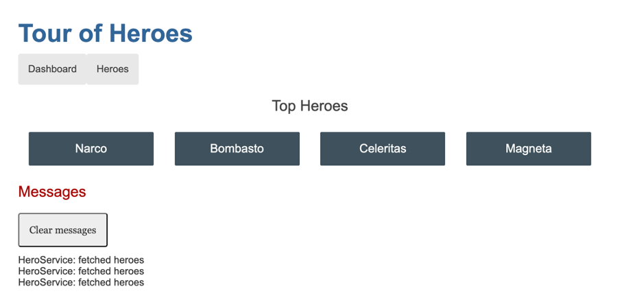

# Introducción a la demo

Para no perder el tiempo con una aplicación creada desde cero, y que además tengamos todas las partes que necesitamos para entender todo lo que te ofrece Microsoft Azure, vamos a utilizar el front-end del tutorial de Angular Tour of Heroes, con unas ligeras modificaciones 😙



 Si quieres generarlo por tu cuenta desde cero los pasos aquí: [https://angular.io/tutorial/tour-of-heroes](https://angular.io/tutorial/tour-of-heroes), pero no te hará falta para esta clase. El resultado del mismo puedes encontrarlo en [01-stack-relacional/03-cloud/azure/01-depliegue-de-tu-primera-app/front-end](front-end/).

Para comprobar que funciona correctamente lanza los siguientes comandos:

```bash
cd front-end
npm install
npm start
```

Este tutorial termina con una API en memoria como parte de la solución, pero nosotros queremos que sea una API real y que se conecte a una base de datos real. 

Por ello, para el backend, he creado una API en .NET Core, utilizando Entity Framework, y que se apoya en un SQL Server, que devolverá los héroes y nos permitirá manipularlos. Para ello he utilizado este otro tutorial para crear APIs en .NET donde está orientado a una lista de TODOs y yo simplemente lo he cambiado a la lista de héroes que necesitamos: https://docs.microsoft.com/es-es/aspnet/core/tutorials/first-web-api?view=aspnetcore-5.0&tabs=visual-studio-code 

El resultado final lo puedes encontrar en la carpeta back-end de este repositorio.

Para que esta API pueda funcionar necesitarás además de una base de datos SQL Server. Como venimos de una clase de Docker en tres horas 😙 y sabemos que podemos utilizar un contenedor para hospedar la misma vamos a crearlo con el siguiente comando:

```bash
docker run \
--name sqlserver \
-e 'ACCEPT_EULA=1' \
-e 'MSSQL_SA_PASSWORD=Password1!' \
 -v mssqlserver_volume:/var/opt/mssql \
-p 1433:1433 \
-d mcr.microsoft.com/azure-sql-edge
```
Ahora entra en el directorio `back-end` y ejecuta la API:

```bash
cd back-end
dotnet run
```

Si todo ha ido bien, deberías poder acceder a la API en `https://localhost:5001/api/hero` y verás que te devolverá un JSON vacío, ya que todavía no hemos añadido ningún héroe.

Para añadir algunos y que veas que la aplicación funciona puedes utilizar el archivo `client.http` que encontrarás en la carpeta `back-end` y que puedes ejecutar con la extensión de Visual Studio Code `REST Client`.
